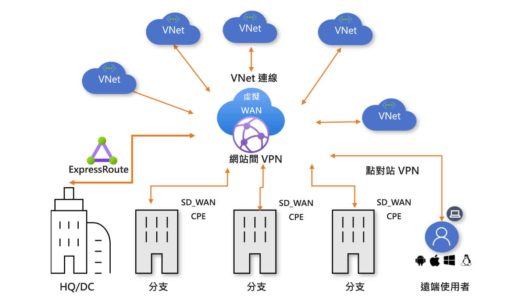

# 關於 Azure 虛擬 WAN

Azure 虛擬 WAN 是一種網路服務，可將許多網路功能、安全性和路由功能結合在一起，以提供單一操作介面。 這些功能包括分支連線 (透過來自虛擬 WAN 合作夥伴裝置的連線自動化，例如 SD-WAN 或 VPN CPE)、站對站 VPN 連線、遠端使用者 VPN (點對站) 連線、私人 (ExpressRoute) 連線、雲端內連線 (虛擬網路的過渡連線)、VPN ExpressRoute 互連能力、路由、Azure 防火牆、私人連線加密。 您不需要擁有所有這些使用案例，就能開始使用虛擬 WAN。 您可以只開始使用一個使用案例，然後在網路演變時進行調整。

虛擬 WAN 架構是中樞與輪輻架構，具有內建的規模和效能，包括分支 (VPN/SD-WAN 裝置)、使用者 (Azure VPN/OpenVPN/IKEv2 用戶端)、ExpressRoute 線路和虛擬網路。 其會實現[全域傳輸網路架構](virtual-wan-global-transit-network-architecture.md)，讓雲端裝載的網路「中樞」能夠在可能分散到不同「輪輻」類型的端點之間實現傳輸連線。

Azure 區域作為中樞，您可以選擇連線到該中樞。 所有中樞都會在標準虛擬 WAN 中以完整網格連線，讓使用者可以輕鬆地使用 Microsoft 骨幹進行任意點對任意點 (任何輪輻) 的連線。 針對具有 SD-WAN/VPN 裝置的輪輻連線能力，使用者可以在 Azure 虛擬 WAN 中手動設定，或使用虛擬 WAN CPE (SD-WAN/VPN) 合作夥伴來設定與 Azure 的連線。 我們有一份支援與 Azure 虛擬 WAN 連線自動化的合作夥伴清單 (能夠將裝置資訊匯出至 Azure、下載 Azure 組態，並建立連線)。 如需詳細資訊，請參閱[虛擬 WAN 夥伴與位置](virtual-wan-locations-partners.md)一文。

本文可讓您快速檢視 Azure 虛擬 WAN 中的網路連線。 虛擬 WAN 提供下列優點：

* **中樞和輪幅中的整合式連線解決方案：** 自動化站對站設定，以及內部部署網站與 Azure 中樞之間的連線。
* **自動化輪輻設定和組態：** 將您的虛擬網路和工作負載順暢地連線至 Azure 中樞。
* **直覺式疑難排解：** 您可以看到 Azure 內的端對端流程，然後使用此資訊來採取必要的動作。

## 基本和標準的虛擬 WAN

虛擬 WAN 有兩種類型：基本和標準。 下表顯示每種類型的可用設定。

[!INCLUDE [Basic and Standard SKUs](../../includes/virtual-wan-standard-basic-include.md)]

如需如何升級虛擬 WAN 的步驟，請參閱[將虛擬 WAN 從基本升級至標準](upgrade-virtual-wan.md)。

## 架構

如需有關虛擬 WAN 架構以及如何遷移至虛擬 WAN 的詳細資訊，請參閱下列文章：

* [虛擬 WAN 架構](migrate-from-hub-spoke-topology.md)
* [全域傳輸網路架構](virtual-wan-global-transit-network-architecture.md)

## 虛擬 WAN 資源

若要設定端對端虛擬 WAN，您可以建立下列資源：

* **virtualWAN：** 虛擬 WAN 資源代表您 Azure 網路的虛擬覆疊，而且是多個資源的集合。 它包含所有您想要包含在虛擬 WAN 內虛擬中樞的連結。 虛擬 WAN 資源會互相隔離，且不能包含一般的中樞。 跨虛擬 WAN 的虛擬中樞不會互相通訊。

* **中樞：** 虛擬中樞是受 Microsoft 管理的虛擬網路。 中樞包含各種可實現連線的服務端點。 從內部部署網路 (vpnsite)，您可以連線到虛擬中樞內的 VPN 閘道、將 ExpressRoute 線路連線到虛擬中樞，或甚至將行動使用者連線到虛擬中樞內的點對站閘道。 中樞是您在區域中的網路核心。 每個 Azure 區域只能有一個中樞。

  中樞閘道與您用於 ExpressRoute 與 VPN 閘道的虛擬網路閘道不同。 例如，當您使用虛擬 WAN 時，不用從您的內部部署網站直接建立與您 VNet 的站對站連線。 但是，您要建立與中樞的站對站連線。 流量一律會傳送到中樞閘道。 這表示您的 VNet 不需要自己的虛擬網路閘道。 虛擬 WAN 可透過虛擬中樞和虛擬中樞閘道，讓您的 VNet 輕鬆地利用調整功能。

* **中樞虛擬網路連線：** 您可以使用中樞虛擬網路連線資源，順暢地將中樞連線到您的虛擬網路。

* **中樞對中樞連線：** 中樞會在虛擬 WAN 中彼此連線。 這表示連線到本機中樞的分支、使用者或 VNet，可以使用已連線中樞的完整網格架構來與另一個分支或 VNet 通訊。 您也可以在透過虛擬中樞來傳輸的中樞內與其中的 VNet 連線，以及使用中樞對中樞連線架構來跨中樞與 VNet 連線。

* **中樞路由表：** 您可以建立虛擬中樞路由並將路由套用到虛擬中樞路由表。 您可以將多個路由套用到虛擬中樞路由表。

**其他虛擬 WAN 資源**

* **站台：** 此資源僅用於站對站連線。 站台資源為 **vpnsite**。 它代表您的內部部署 VPN 裝置及其設定。 使用虛擬 WAN 合作夥伴，您將擁有內建的解決方案，會將這項資訊自動匯出至 Azure。

## 連線類型

虛擬 WAN 可實現下列類型的連線：站對站 VPN、使用者 VPN (點對站) 和 ExpressRoute。

### 站對站 VPN 連線

您可以透過站對站IPsec/IKE (IKEv2) 連線，來連線到您在 Azure 中的資源。 如需詳細資訊，請參閱[使用虛擬 WAN 建立站對站連線](virtual-wan-site-to-site-portal.md)。 

此類型的連線需要 VPN 裝置或虛擬 WAN 合作夥伴裝置。 虛擬 WAN 合作夥伴提供自動連線功能，可將裝置資訊匯出至 Azure、下載 Azure 設定，以及建立與 Azure 虛擬 WAN 中樞的連線。 如需可用夥伴和位置的清單，請參閱[虛擬 WAN 夥伴與位置](virtual-wan-locations-partners.md)一文。 如果您的 VPN/SD-WAN 裝置提供者未列在提及的連結中，您可以直接透過＜[使用虛擬 WAN 建立站對站連線](virtual-wan-site-to-site-portal.md)＞的逐步指示來設定連線。

### 使用者 VPN (點對站) 連線

您可以透過 IPsec/IKE (IKEv2) 或 OpenVPN 連線，來連線到您在 Azure 中的資源。 此類型的連線需要在用戶端電腦上設定 VPN 用戶端。 如需詳細資訊，請參閱[建立點對站連線](virtual-wan-point-to-site-portal.md)。

### ExpressRoute 連線
ExpressRoute 可讓您透過私人連線將內部部署網路連線至 Azure。 若要建立連線，請參閱[使用虛擬 WAN 建立 ExpressRoute 連線](virtual-wan-expressroute-portal.md)。

### 中樞對 VNet 的連線

您可以將 Azure 虛擬網路連線至虛擬中樞。 如需詳細資訊，請參閱[將 VNet 連線至中樞](virtual-wan-site-to-site-portal.md#vnet)。

### 傳輸連線能力

#### VNet 之間的傳輸連線能力

虛擬 WAN 可讓 VNet 之間進行傳輸連線。 VNet 可透過虛擬網路連線來連線至虛擬中樞。 在**標準虛擬 WAN** 中，VNet 之間的傳輸連線會藉由每個虛擬中樞內的路由器來啟用。 路由器會在第一次建立虛擬中樞時具現化。

路由器可以有四個路由狀態：已佈建、佈建中、失敗或無。 **路由狀態**位於 Azure 入口網站中的 [虛擬中樞] 頁面上。

* [**無**] 狀態表示虛擬中樞並未佈建路由器。 如果虛擬 WAN 的類型是「基本」，或虛擬中樞在服務可供使用之前部署，就會發生這種情況。
* [**失敗**] 狀態表示在具現化期間發生失敗。 若要具現化或重設路由器，您可以瀏覽至 Azure 入口網站中的虛擬中樞概觀頁面，找出 [重設路由器] 選項。

每個虛擬中樞路由器最多支援 50 Gbps 的彙總輸送量。 虛擬網路連線之間的連線會假設虛擬 WAN 中的所有 VNet 上有總數為 2000 部 VM 的工作負載。

#### VPN 和 ExpressRoute 之間的傳輸連線能力

虛擬 WAN 可讓 VPN 和 ExpressRoute 之間進行傳輸連線。 這表示以 VPN 連線的網站或遠端使用者可以與以 ExpressRoute 連線的網站通訊。 此外，也會隱含**分支對分支旗標**已啟用的假設。 此旗標可能位於 Azure 入口網站的 Azure 虛擬 WAN 設定中。 所有路由管理都是由虛擬中樞路由器提供，這也會啟用虛擬網路之間的傳輸連線能力。

### 自訂路由

虛擬 WAN 提供進階的路由增強功能。 能夠設定自訂路由表、使用路由關聯和傳播來最佳化虛擬網路路由、以邏輯方式將具有標籤的路由表分組，以及簡化許多網路虛擬設備或共用的服務路由案例。

### 全域 VNet 對等互連

全域 VNet 對等互連提供可將不同區域中兩個 VNet 連線的機制。 在虛擬 WAN 中，虛擬網路連線會將 VNet 連線到虛擬中樞。 使用者不需要明確設定全域 VNet 對等互連。 VNet 連線到相同區域中的虛擬中樞時會產生 VNet 對等互連費用。 VNet 連線到不同區域中的虛擬中樞時會產生全域 VNet 對等互連費用。

### ExpressRoute 流量加密

Azure 虛擬 WAN 可為 ExpressRoute 流量提供加密功能。 此技術透過 ExpressRoute 來提供內部部署網路與 Azure 虛擬網路之間的加密傳輸，而不需要經過公用網際網路或使用公用 IP 位址。 如需詳細資訊，請參閱[針對虛擬 WAN 透過 ExpressRoute 建立 IPsec](vpn-over-expressroute.md)。

## 位置

如需位置資訊，請參閱[虛擬 WAN 夥伴與位置](virtual-wan-locations-partners.md)一文。

## 基本和標準虛擬 WAN 中的路由表

路由表現在具有關聯和傳播的功能。 既有的路由表是不具有這些功能的路由表。 如果您在中樞路由中有既有的路由，但想要使用新功能，請考慮下列方式：

* **虛擬中樞內存在既有路由的標準虛擬 WAN 客戶**：若要使用新的路由表功能，請等候至 8 月 3 日這週會在 Azure 中推出。 如果您在 Azure 入口網站中樞的 [路由] 區段中已存在路由，則需要先將這些路由刪除，然後嘗試建立新的路由表 (可在 Azure 入口網站中樞的 [路由表] 區段中取得)。

* **虛擬中樞內存在既有路由的基本虛擬 WAN 客戶**：若要使用新的路由表功能，請等候至 8 月 3 日這週會在 Azure 中推出。 如果您在 Azure 入口網站中樞的 [路由] 區段中已存在路由，則需要先將這些路由刪除，然後將基本虛擬 WAN **升級**為標準虛擬 WAN。 請參閱[將虛擬 WAN 從基本升級至標準](upgrade-virtual-wan.md)。

## 常見問題集

[!INCLUDE [Virtual WAN FAQ](../../includes/virtual-wan-faq-include.md)]

## 後續步驟

[使用虛擬 WAN 建立站對站連線](virtual-wan-site-to-site-portal.md)
