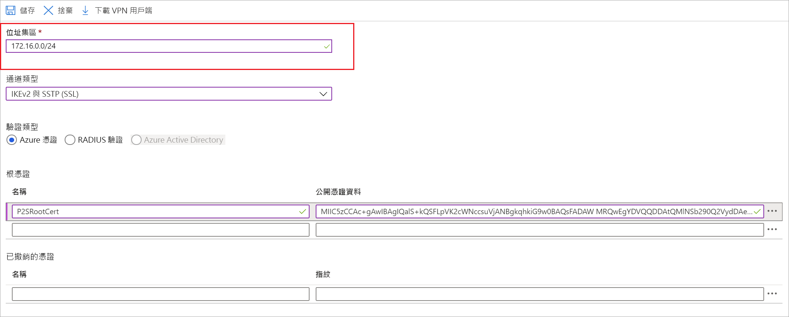
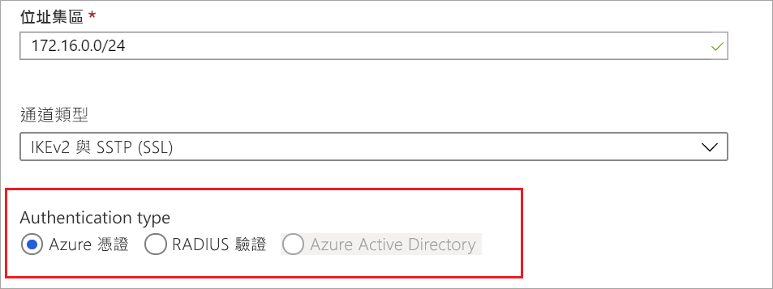
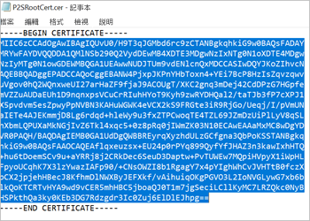
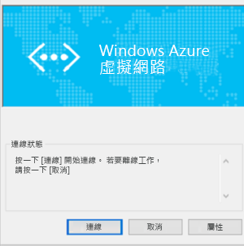
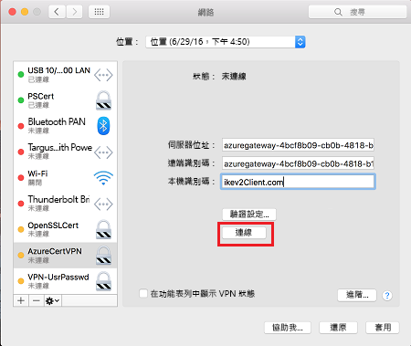

# <a name="configure-a-point-to-site-vpn-connection-to-a-vnet-using-native-azure-certificate-authentication-azure-portal"></a>使用原生 Azure 憑證驗證設定 VNet 的點對站 VPN 連線： Azure 入口網站

本文可協助您將執行 Windows、Linux 或 Mac OS X 的個別用戶端安全地連線至 Azure VNet。 當您想要從遠端位置 (例如當您從住家或會議進行遠距工作) 連線到您的 VNet 時，點對站 VPN 連線很實用。 如果您只有少數用戶端必須連線至 VNet，您也可以使用 P2S，而不使用站對站 VPN。 點對站連線不需要 VPN 裝置或公眾對應 IP 位址。 P2S 會建立透過 SSTP (安全通訊端通道通訊協定) 或 IKEv2 的 VPN 連線。 如需點對站 VPN 的詳細資訊，請參閱[關於點對站 VPN](point-to-site-about.md)。


## <a name="architecture"></a>架構

點對站原生 Azure 憑證驗證連線須使用下列項目 (您可以在此練習中設定)：

* RouteBased VPN 閘道。
* 已上傳至 Azure 之根憑證的公開金鑰 (.cer 檔案)。 一旦上傳憑證，憑證就會被視為受信任的憑證並且用於驗證。
* 從根憑證產生的用戶端憑證。 此用戶端憑證須安裝在每部將連線至 VNet 的用戶端電腦上。 此憑證使用於用戶端憑證。
* VPN 用戶端組態。 VPN 用戶端組態檔包含要讓用戶端連線到 VNet 所需的資訊。 此檔案會設定作業系統原生的現有 VPN 用戶端。 您必須使用組態檔中的設定來設定每個進行連線的用戶端。

#### <a name="example-values"></a><a name="example"></a>範例值

您可以使用下列值來建立測試環境，或參考這些值來進一步了解本文中的範例：

* **VNet 名稱：** VNet1
* **位址空間：** 10.1.0.0/16<br>在此範例中，我們只使用一個位址空間。 您可以針對 VNet 使用一個以上的位址空間。
* **子網名稱：** 前端
* **子網位址範圍：** 10.1.0.0/24
* **訂用帳戶：** 如果您有一個以上的訂用帳戶，請確認您使用正確的訂用帳戶。
* **資源群組：** TestRG1
* **位置：** 美國東部
* **GatewaySubnet：** 10.1.255.0/27<br>
* **虛擬網路閘道名稱：** VNet1GW
* **閘道類型：** Vpn
* **VPN 類型：** 以路由為基礎
* **公用 IP 位址名稱：** VNet1GWpip
* **連線類型：** 點對站
* **用戶端位址集區：** 172.16.201.0/24<br>使用這個點對站連線來連線到 VNet 的 VPN 用戶端，會收到來自用戶端位址集區的 IP 位址。

## <a name="1-create-a-virtual-network"></a><a name="createvnet"></a>1. 建立虛擬網路

在開始之前，請確認您有 Azure 訂用帳戶。 如果您還沒有 Azure 訂用帳戶，您可以啟用 [MSDN 訂閱者權益](https://azure.microsoft.com/pricing/member-offers/msdn-benefits-details) 或註冊 [免費帳戶](https://azure.microsoft.com/pricing/free-trial)。
[!INCLUDE [Basic Point-to-Site VNet](../../includes/vpn-gateway-basic-vnet-rm-portal-include.md)]

## <a name="2-create-a-virtual-network-gateway"></a><a name="creategw"></a>2. 建立虛擬網路閘道

此步驟將帶您建立 VNet 的虛擬網路閘道。 建立閘道通常可能需要 45 分鐘或更久，視選取的閘道 SKU 而定。

>[!NOTE]
>基本閘道 SKU 不支援 IKEv2 或 RADIUS 驗證。 如果您計畫讓 Mac 用戶端連線到您的虛擬網路，請不要使用基本 SKU。
>

[!INCLUDE [About gateway subnets](../../includes/vpn-gateway-about-gwsubnet-portal-include.md)]

[!INCLUDE [Create a gateway](../../includes/vpn-gateway-add-gw-rm-portal-include.md)]

## <a name="3-generate-certificates"></a><a name="generatecert"></a>3. 產生憑證

憑證是 Azure 用於驗證透過點對站 VPN 連線來連線至 VNet 的用戶端。 一旦您取得根憑證，您可將公開金鑰資訊[上傳](#uploadfile)至 Azure。 根憑證則會被視為 Azure「信任的」，可供透過 P2S 連線至虛擬網路。 您也可以從受信任的根憑證產生用戶端憑證，然後將它們安裝在每部用戶端電腦上。 在用戶端初始 VNet 連線時，用戶端憑證用來驗證用戶端。 

### <a name="1-obtain-the-cer-file-for-the-root-certificate"></a><a name="getcer"></a>1. 取得根憑證的 .cer 檔案

[!INCLUDE [root-certificate](../../includes/vpn-gateway-p2s-rootcert-include.md)]

### <a name="2-generate-a-client-certificate"></a><a name="generateclientcert"></a>2. 產生用戶端憑證

[!INCLUDE [generate-client-cert](../../includes/vpn-gateway-p2s-clientcert-include.md)]

## <a name="4-add-the-client-address-pool"></a><a name="addresspool"></a>4. 新增用戶端位址集區

用戶端位址集區是您指定的私人 IP 位址範圍。 透過點對站 VPN 連線的用戶端會動態收到這個範圍內的 IP 位址。 使用不會重疊的私人 IP 位址範圍搭配您從其連線的內部部署位置，或搭配您要連線至的 VNet。 如果您設定多個通訊協定，且 SSTP 是其中一個通訊協定，則設定的位址集區會平均地在設定的通訊協定之間進行分割。

1. 一旦建立虛擬網路閘道，請瀏覽至虛擬網路閘道頁面的 [設定]**** 區段。 在 [ **設定** ] 區段中，選取 [ **點對站**設定]。 選取 [ **立即設定** ] 以開啟 [設定] 頁面。

   
2. 在 [ **點對站** 設定] 頁面上，您可以設定各種不同的設定。 如果您在此頁面上未看到通道類型或驗證類型，則您的閘道會使用基本 SKU。 基本 SKU 不支援 IKEv2 或 RADIUS 驗證。 如果您想要使用這些設定，您必須使用不同的閘道 SKU 來刪除並重新建立閘道。

   [](./media/vpn-gateway-howto-point-to-site-resource-manager-portal/certificate-settings-expanded.png#lightbox)
3. 在 [ **位址集區** ] 方塊中，新增您想要使用的私人 IP 位址範圍。 VPN 用戶端會動態收到您指定範圍內的 IP 位址。 適用于主動/被動的最小子網路遮罩為29位，主動/主動設定為28位。
4. 移至下一節以設定通道類型。

## <a name="5-configure-tunnel-type"></a><a name="tunneltype"></a>5. 設定通道類型

您可以選取通道類型。 通道選項為 OpenVPN、SSTP 和 IKEv2。

* Android 和 Linux 上的 strongSwan 用戶端以及 iOS 和 OSX 上的原生 IKEv2 VPN 用戶端只會使用 IKEv2 通道來進行連線。
* Windows 用戶端會先嘗試 IKEv2，如果未連線，則會回復為 SSTP。
* 您可以使用 OpenVPN 用戶端連接到 OpenVPN 通道類型。


## <a name="6-configure-authentication-type"></a><a name="authenticationtype"></a>6. 設定驗證類型

針對 [ **驗證類型**]，選取 [ **Azure 憑證**]。

  

## <a name="7-upload-the-root-certificate-public-certificate-data"></a><a name="uploadfile"></a>7. 上傳根憑證公開憑證資料

您可以上傳其他受信任的根憑證檔案 (最多總計 20 個憑證)。 一旦上傳公開憑證資料，Azure 就可以使用它來驗證已安裝從受信任根憑證產生之用戶端憑證的用戶端。 將根憑證的公開金鑰資訊上傳至 Azure。

1. 新增憑證時，是在 [點對站組態]**** 頁面的 [根憑證]**** 區段中新增。
2. 請確定您以 Base-64 編碼 X.509 (.cer) 檔案形式匯出根憑證。 您需要以這種格式匯出憑證，以便可以使用文字編輯器開啟憑證。
3. 使用文字編輯器 (例如「記事本」) 開啟憑證。 複製憑證資料時，請確定您是以連續一行的形式複製文字，而不含歸位字元或換行字元。 您可能必須將文字編輯器中的檢視修改成 [顯示符號] 或 [顯示所有字元]，才能看到歸位字元和換行字元。 請只以連續一行的形式複製下列區段：

   
4. 將憑證資料貼到 [公開憑證資料]**** 欄位中。 為憑證**命名**，然後選取 [**儲存**]。 您最多可新增 20 個受信任的根憑證。

   
5. 選取頁面頂端的 [ **儲存** ]，以儲存所有的設定。

   

## <a name="8-install-an-exported-client-certificate"></a><a name="installclientcert"></a>8. 安裝匯出的用戶端憑證

如果您想要從不同於用來產生用戶端憑證的用戶端電腦建立 P2S 連線，您需要安裝用戶端憑證。 安裝用戶端憑證時，您需要匯出用戶端憑證時所建立的密碼。

請確定用戶端憑證已隨著整個憑證鏈結匯出為 .pfx (這是預設值)。 否則，根憑證資訊不存在於用戶端電腦上，而且用戶端將無法正確驗證。

如需安裝步驟，請參閱[安裝用戶端憑證](point-to-site-how-to-vpn-client-install-azure-cert.md)。

## <a name="9-generate-and-install-the-vpn-client-configuration-package"></a><a name="clientconfig"></a>9. 產生並安裝 VPN 用戶端設定套件

VPN 用戶端組態檔所包含的設定，可用來將裝置設定為透過 P2S 連線來連線至 VNet。 如需產生和安裝 VPN 用戶端組態檔的指示，請參閱[建立和安裝適用於原生 Azure 憑證驗證 P2S 組態的 VPN 用戶端組態檔](point-to-site-vpn-client-configuration-azure-cert.md)。

## <a name="10-connect-to-azure"></a><a name="connect"></a>10. 連接至 Azure

### <a name="to-connect-from-a-windows-vpn-client"></a>從 Windows VPN 用戶端連線

>[!NOTE]
>您必須在您所連線的 Windows 用戶端電腦上具有系統管理員權限。
>
>

1. 若要連接至您的 VNet，在用戶端電腦上瀏覽到 VPN 連線，然後找出所建立的 VPN 連線。 其名稱會與虛擬網路相同。 選取 [連接]。 可能會出現與使用憑證有關的快顯訊息。 選取 [ **繼續** ] 以使用較高的許可權。

2. 在 [連線]**** 狀態頁面上，選取 [連線]**** 以便開始連線。 如果出現 [選取憑證]**** 畫面，請確認顯示的用戶端憑證是要用來連接的憑證。 如果不是，請使用下拉箭頭來選取正確的憑證，然後選取 **[確定]**。

   
3. 已建立您的連線。

   

#### <a name="troubleshoot-windows-p2s-connections"></a>針對 Windows P2S 連線進行疑難排解

[!INCLUDE [verifies client certificates](../../includes/vpn-gateway-certificates-verify-client-cert-include.md)]

### <a name="to-connect-from-a-mac-vpn-client"></a>從 Mac VPN 用戶端連線

從 [網路] 對話方塊中，找出您要使用的用戶端設定檔，指定 [VpnSettings.xml](point-to-site-vpn-client-configuration-azure-cert.md#installmac)中的設定，然後選取 [連線 **]**。

如需詳細指示，請參閱[安裝 - Mac (OS X)](https://docs.microsoft.com/azure/vpn-gateway/point-to-site-vpn-client-configuration-azure-cert#installmac)。 如果您在連線時發生問題，請確認虛擬網路閘道不是使用「基本」SKU。 針對 Mac 用戶端不支援「基本」SKU。

  

## <a name="to-verify-your-connection"></a><a name="verify"></a>驗證您的連線

這些指示適用於 Windows 用戶端。

1. 若要驗證您的 VPN 連線為作用中狀態，請開啟提升權限的命令提示字元，並執行 *ipconfig/all*。
2. 檢視結果。 請注意，您接收到的 IP 位址是您在組態中指定的點對站 VPN 用戶端位址集區中的其中一個位址。 結果類似於此範例：

   ```
   PPP adapter VNet1:
      Connection-specific DNS Suffix .:
      Description.....................: VNet1
      Physical Address................:
      DHCP Enabled....................: No
      Autoconfiguration Enabled.......: Yes
      IPv4 Address....................: 172.16.201.3(Preferred)
      Subnet Mask.....................: 255.255.255.255
      Default Gateway.................:
      NetBIOS over Tcpip..............: Enabled
   ```

## <a name="to-connect-to-a-virtual-machine"></a><a name="connectVM"></a>連線至虛擬機器

這些指示適用於 Windows 用戶端。

[!INCLUDE [Connect to a VM](../../includes/vpn-gateway-connect-vm-p2s-include.md)]

## <a name="to-add-or-remove-trusted-root-certificates"></a><a name="add"></a>新增或移除受信任的根憑證

您可以從 Azure 新增和移除受信任的根憑證。 當您移除根憑證時，從該根憑證產生憑證的用戶端將無法進行驗證，因而無法進行連線。 若希望用戶端進行驗證和連線，您需要安裝從 Azure 信任 (已上傳至 Azure) 的根憑證產生的新用戶端憑證。

### <a name="to-add-a-trusted-root-certificate"></a>若要新增受信任的根憑證

您最多可新增 20 個受信任的根憑證 .cer 檔案至 Azure。 如需指示，請參閱這篇文章的[上傳受信任的根憑證](#uploadfile)一節。

### <a name="to-remove-a-trusted-root-certificate"></a>移除受信任的根憑證

1. 若要移除受信任的根憑證，瀏覽至虛擬網路閘道的 [點對站組態]**** 頁面。
2. 在頁面的 [根憑證]**** 區段中，找出您想要移除的憑證。
3. 選取憑證旁的省略號，然後選取 [移除]。

## <a name="to-revoke-a-client-certificate"></a><a name="revokeclient"></a>若要撤銷用戶端憑證

您可以撤銷用戶端憑證。 憑證撤銷清單可讓您選擇性地拒絕以個別的用戶端憑證為基礎的點對站連線。 這與移除受信任的根憑證不同。 若您從 Azure 移除受信任的根憑證 .cer，就會撤銷所有由撤銷的根憑證所產生/簽署的用戶端憑證之存取權。 撤銷用戶端憑證，而不是根憑證，可以繼續使用從根憑證產生的憑證進行驗證。

常見的做法是使用根憑證管理小組或組織層級的存取權，然後使用撤銷的用戶端憑證針對個別使用者進行細部的存取控制。

### <a name="revoke-a-client-certificate"></a>撤銷用戶端憑證

您可以藉由將指紋新增至撤銷清單來撤銷用戶端憑證。

1. 擷取用戶端憑證指紋。 如需詳細資訊，請參閱 [如何取出憑證的憑證指紋](https://msdn.microsoft.com/library/ms734695.aspx)。
2. 將資訊複製到文字編輯器，並移除所有的空格，讓它是連續字串。
3. 瀏覽至虛擬網路閘道 [點對站組態]**** 頁面。 這個頁面與您用來[上傳受信任根憑證](#uploadfile)的頁面相同。
4. 在 [撤銷憑證]**** 區段中，輸入憑證的易記名稱 (它不一定是憑證 CN)。
5. 將指紋字串複製並貼上到 [指紋]**** 欄位。
6. 指紋會進行驗證，並且自動新增至撤銷清單。 畫面上會出現一則訊息，指出清單正在更新。 
7. 更新完成之後，憑證無法再用於連線。 嘗試使用此憑證進行連線的用戶端會收到訊息，指出憑證不再有效。

## <a name="point-to-site-faq"></a><a name="faq"></a>點對站常見問題集

[!INCLUDE [Point-to-Site FAQ](../../includes/vpn-gateway-faq-p2s-azurecert-include.md)]

## <a name="next-steps"></a>接下來的步驟
一旦完成您的連接，就可以將虛擬機器加入您的虛擬網路。 如需詳細資訊，請參閱[虛擬機器](https://docs.microsoft.com/azure/)。 若要了解網路與虛擬機器的詳細資訊，請參閱 [Azure 與 Linux VM 網路概觀](../virtual-machines/linux/azure-vm-network-overview.md)。

如需有關為 P2S 疑難排解的資訊，請參閱[針對 Azure 點對站連線進行疑難排解](vpn-gateway-troubleshoot-vpn-point-to-site-connection-problems.md)。
