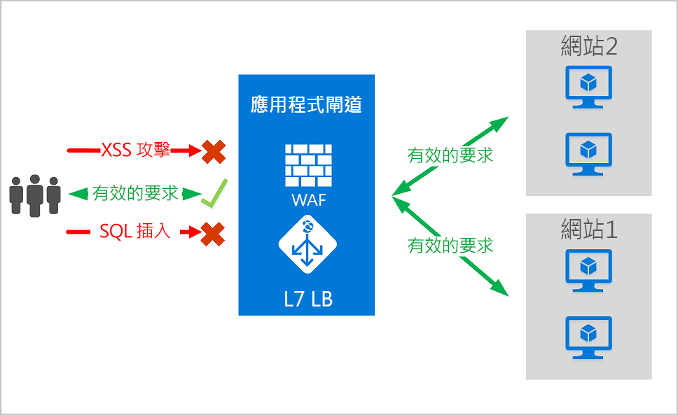
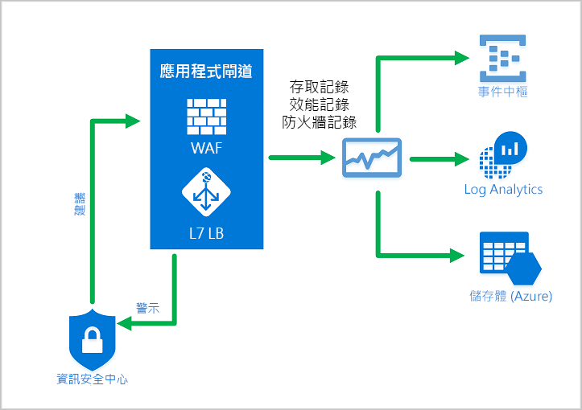
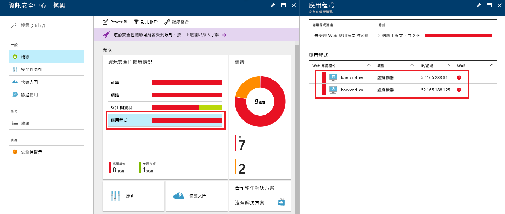
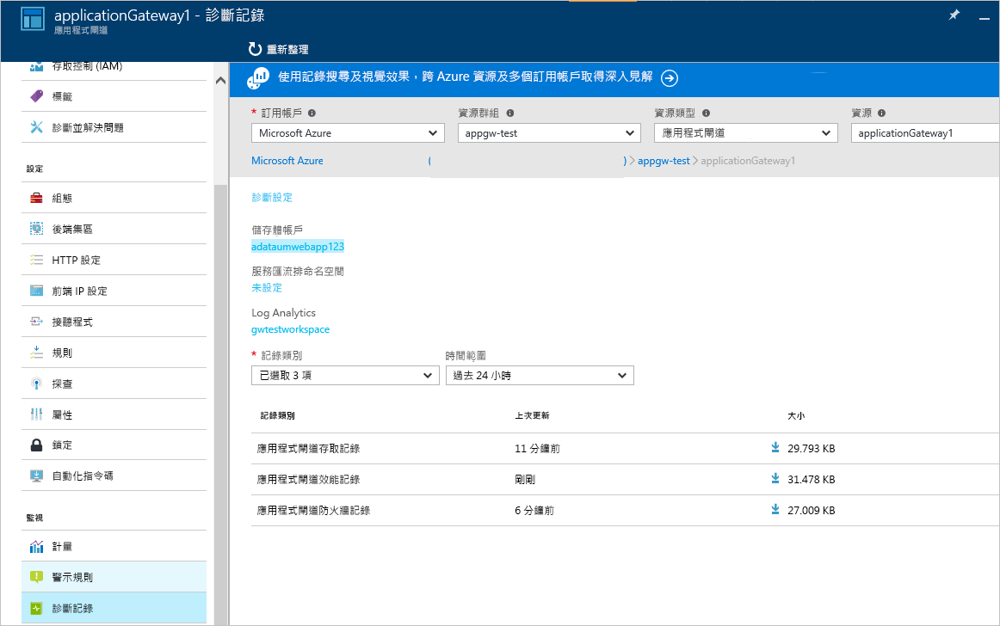

# <a name="what-is-azure-web-application-firewall-on-azure-application-gateway"></a>什麼是 Azure 應用程式閘道上的 Web 應用程式防火牆?

Azure 應用程式閘道上的 Azure Web 應用程式防火牆 (WAF) 可為 Web 應用程式提供集中式保護，使其免於遭遇常見的攻擊和弱點。 Web 應用程式已逐漸成為利用常見已知弱點進行惡意攻擊的目標。 在這之中，SQL 插入式和跨網站指令碼攻擊是最常見的攻擊。

應用程式閘道上的 WAF 會以 Open Web Application Security Project (OWASP) 的[核心規則集 (CRS)](https://owasp.org/www-project-modsecurity-core-rule-set/) 3.1、3.0 或 2.2.9 為基礎。 WAF 會自動更新以加入對新弱點的保護，而不需要額外的設定。 

下面列出的所有 WAF 功能都會存在 WAF 原則中。 您可以對個別接聽程式，或應用程式閘道上的路徑型路由規則，建立多個原則，並可將這些原則與應用程式閘道建立關聯。 如此一來，您就可以為應用程式閘道背後的每個網站提供個別原則 (如果有需要的話)。 如需有關 WAF 原則的詳細資訊，請參閱[建立 WAF 原則](create-waf-policy-ag.md)。



應用程式閘道會以應用程式傳遞控制站 (ADC) 的形式運作。 其提供前稱為安全通訊端層 (SSL) 的傳輸層安全性 (TLS)、終止、Cookie 型工作階段同質、循環配置資源負載分配、內容型路由，以及裝載多個網站和安全性增強功能的能力。

應用程式閘道的安全性增強功能包括 TLS 原則管理和端對端 TLS 支援。 WAF 與應用程式閘道的整合加強了應用程式安全性。 這種組合可讓 Web 應用程式免於遭受常見的弱點威脅。 並且提供容易設定的中央位置來進行管理。

## <a name="benefits"></a>優點

本節說明 WAF 在應用程式閘道上所提供的核心優勢。

### <a name="protection"></a>保護

* 不需修改後端程式碼就能保護 Web 應用程式不受 Web 弱點和攻擊的威脅。

* 同時保護多個 Web 應用程式。 應用程式閘道的執行個體最多可以裝載 40 個由 Web 應用程式防火牆所保護的網站。

* 針對相同 WAF 後方的不同網站建立自訂 WAF 原則 

* 使用 IP 信譽規則集 (預覽) 防止 Web 應用程式遭受惡意 Bot 的威脅

### <a name="monitoring"></a>監視

* 使用即時 WAF 記錄來監視以 Web 應用程式為目標的攻擊。 此記錄已經與 [Azure 監視器](../../azure-monitor/overview.md)整合，可追蹤 WAF 警示並輕鬆地監視趨勢。

* 應用程式閘道 WAF 已經與 Azure 資訊安全中心整合。 資訊安全中心可提供所有 Azure 資源安全性狀態的集中檢閱。

### <a name="customization"></a>自訂

* 自訂 WAF 規則和規則群組，以符合您的應用程式需求並消除誤判。

* 為 WAF 後面的每個網站建立相關聯的 WAF 原則，以允許專屬於網站的設定

* 建立自訂規則以符合您應用程式的需求

## <a name="features"></a>特性

- SQL 插入式保護。
- 跨網站指令碼保護。
- 抵禦其他常見 Web 攻擊，例如命令插入、HTTP 要求走私、HTTP 回應分割和遠端檔案包含攻擊。
- 防範 HTTP 通訊協定違規。
- 防範 HTTP 通訊協定異常 (例如遺漏主機使用者代理程式和接受標頭)。
- 防範編目程式和掃描器。
- 偵測一般應用程式錯誤組態 (例如 Apache 和 IIS)。
- 可設定要求大小限制，包含上限與下限。
- 排除清單可讓您略過 WAF 評估的特定要求屬性。 常見範例是用於驗證或密碼欄位的 Active Directory 插入式權杖。
- 建立自訂規則以符合您應用程式的特定需求。
- 進行流量的地理篩選，以允許或阻止特定國家/區域取得應用程式的存取權。 (預覽)
- 使用 Bot 風險降低規則集，保護您的應用程式不受 Bot 影響。 (預覽)
- 檢查要求本文中的 JSON 和 XML

## <a name="waf-policy-and-rules"></a>WAF 原則和規則

若要在應用程式閘道上啟用 Web 應用程式防火牆，您必須建立 WAF 原則。 此原則中包含所有受控規則、自訂規則、排除項目及其他自訂項目 (例如檔案上傳限制)。

您可以設定 WAF 原則，並將其與一或多個應用程式閘道建立關聯以進行保護。 WAF 原則包含兩種類型的安全性規則：

- 您建立的自訂規則

- 受控規則集，一組由 Azure 管理且預先設定的規則集合

當兩者都存在時，會先處理自訂規則，然後再處理受控規則集內的規則。 規則是由比對條件、優先順序和動作所組成。 支援的動作類型為：ALLOW、BLOCK 和 LOG。 您可以結合受控和自訂規則，建立符合特定應用程式保護需求的完全自訂原則。

原則中的規則會依照優先順序來處理。 優先順序是唯一整數，可定義規則的處理順序。 較小的整數值表示較高的優先順序，並且這些規則會在整數值較高的規則之前進行評估。 一旦符合規則，規則中所定義的對應動作就會套用至要求。 完成此對比處理之後，優先順序較低的規則就不會再進行處理。

應用程式閘道所傳遞的 Web 應用程式可以在全域層級、在每個網站層級，或在每個 URI 層級建立相關聯的 WAF 原則。

### <a name="core-rule-sets"></a>核心規則集

應用程式閘道支援三個規則集：CRS 3.1、CRS 3.0 和 CRS 2.2.9。 這些規則可防止您 Web 應用程式遭受惡意活動的攻擊。

如需詳細資訊，請參閱 [Web 應用程式防火牆 CRS 規則群組與規則](application-gateway-crs-rulegroups-rules.md)。

### <a name="custom-rules"></a>自訂規則

應用程式閘道也支援自訂規則。 您可以透過自訂規則來建立自己的規則，當每個要求通過 WAF 時，這些規則就會受到評估。 這些規則的優先順序會高於受控規則集中的其餘規則。 如果有一組條件符合，即會採取動作來允許或封鎖要求。 

在自訂規則中，現在已可使用 Geomatch 運算子的公開預覽版。 如需詳細資訊，請參閱 [Geomatch 自訂規則](custom-waf-rules-overview.md#geomatch-custom-rules-preview)。

> [!NOTE]
> 適用於自訂規則的 Geomatch 運算子目前處於公開預覽狀態，並且提供預覽服務等級的協定。 可能不支援特定功能，或可能已經限制功能。 如需詳細資訊，請參閱 [Microsoft Azure 預覽專用的補充使用條款](https://azure.microsoft.com/support/legal/preview-supplemental-terms/)。

如需有關自訂規則詳細資訊，請參閱[應用程式閘道的自訂規則。](custom-waf-rules-overview.md)

### <a name="bot-mitigation-preview"></a>Bot 風險降低 (預覽)

您可以為 WAF 啟用受控的 Bot 保護規則集，並搭配受控規則集來封鎖或記錄已知惡意 IP 位址所發出的要求。 這些 IP 位址皆來自 Microsoft 威脅情報摘要。 包括 Azure 資訊安全中心在內的多項服務皆使用 Intelligent Security Graph，其同時也支援 Microsoft 威脅情報的運作。

> [!NOTE]
> Bot 保護規則集目前處於公開預覽狀態，並且提供預覽服務等級的協定。 可能不支援特定功能，或可能已經限制功能。 如需詳細資訊，請參閱 [Microsoft Azure 預覽專用的補充使用條款](https://azure.microsoft.com/support/legal/preview-supplemental-terms/)。

如果啟用 Bot 保護，符合惡意 Bot 用戶端 IP 的傳入要求會記錄在防火牆記錄中，請參閱下方的詳細資訊。 您可以從儲存體帳戶、事件中樞或記錄分析中存取 WAF 記錄。 

### <a name="waf-modes"></a>WAF 模式

應用程式閘道 WAF 可以設定為在下列兩種模式中執行︰

* **偵測模式**：監視並記錄所有威脅警示。 您應在 [診斷] 區段中開啟應用程式閘道的記錄診斷。 您也必須確保已選取並開啟 WAF 記錄。 在偵測模式中執行的 Web 應用程式防火牆不會封鎖傳入要求。
* **預防模式**：封鎖規則偵測到的入侵和攻擊。 攻擊者會收到「403 未經授權存取」例外狀況，且連線會關閉。 預防模式會將這類攻擊記錄在 WAF 記錄中。

> [!NOTE]
> 在實際執行環境中時，建議您以偵測模式短期執行新部署的 WAF。 這讓您有機會先取得[防火牆記錄](../../application-gateway/application-gateway-diagnostics.md#firewall-log)，並更新任何例外狀況或[自訂規則](./custom-waf-rules-overview.md)之後，再轉換到預防模式。 這有助於減少非預期的流量封鎖發生。

### <a name="anomaly-scoring-mode"></a>異常評分模式

OWASP 有兩種可用來決定是否要封鎖流量的模式：傳統模式和異常評分模式。

在傳統模式中，我們都認為符合任何規則的流量都獨立於任何其他規則相符項目。 此模式易於了解。 但是，不了解有多少規則符合特定要求就是一項限制。 因此，我們引進異常評分模式。 這是 OWASP 3.x 的預設值。

在異常評分模式中，處於預防模式中的防火牆不會立即封鎖符合任何規則的流量。 規則會有特定嚴重性：「重大」、「錯誤」、「警告」或「通知」。 該嚴重性會影響要求的數值，此值稱為異常分數。 例如，符合一個「警告」規則的分數為 3 分。 符合一個「重大」規則的分數為 5 分。

|Severity  |值  |
|---------|---------|
|重大     |5|
|錯誤        |4|
|警告      |3|
|注意事項       |2|

用於封鎖流量的異常分數閾值為 5 分。 因此，符合一個「重大」規則就足以讓應用程式閘道 WAF 封鎖要求，即使在預防模式下也一樣。 但是符合「警告」規則只會將異常分數提高 3 分，其本身並不足以封鎖流量。

> [!NOTE]
> WAF 規則符合流量時所記錄的訊息會包含「已封鎖」動作值。 但是實際上只會封鎖異常分數為 5 分或更高的流量。  

### <a name="waf-monitoring"></a>WAF 監視

監視您應用程式閘道的健康狀態非常重要。 Azure 監視器、Azure 資訊安全中心和 Azure 監視器記錄的整合可協助您監視 WAF 及其保護的應用程式是否狀態良好。



#### <a name="azure-monitor"></a>Azure 監視器

應用程式閘道記錄會與 [Azure 監視器](../../azure-monitor/overview.md)整合。 這可讓您追蹤包括 WAF 警示和記錄的診斷資訊。 您可以移至入口網站中的應用程式閘道資源，從 [診斷] 索引標籤中存取此功能，或直接透過 Azure 監視器存取。 若要深入了解如何啟用記錄，請參閱[應用程式閘道診斷](../../application-gateway/application-gateway-diagnostics.md)。

#### <a name="azure-security-center"></a>Azure 資訊安全中心

[資訊安全中心](../../security-center/security-center-introduction.md)可協助您保護、偵測威脅並採取相應的措施。 此服務可讓您完整檢視並控制 Azure 資源的安全性。 應用程式閘道已經[與資訊安全中心整合](../../application-gateway/application-gateway-integration-security-center.md)。 資訊安全中心會掃描您的環境，以偵測未受保護的 Web 應用程式。 並建議應用程式閘道 WAF 保護這些易受攻擊的資源。 您可以直接從資訊安全中心建立防火牆。 這些 WAF 執行個體會與資訊安全中心整合。 然後將警示和健康情況資訊傳送至資訊安全中心以進行報告。



#### <a name="azure-sentinel"></a>Azure Sentinel

Microsoft Azure Sentinel 是可調整的雲端原生安全性資訊事件管理 (SIEM) 和安全性協調流程自動化回應 (SOAR) 解決方案。 Azure Sentinel 提供整個企業的智慧型安全性分析和威脅情報，並針對警示偵測、威脅可見性、主動式搜捕及回應威脅提供單一解決方案。

透過內建 Azure WAF 防火牆事件活頁簿，您可以在 WAF 上取得安全性事件的概觀。 這包括事件、相符和封鎖的規則，以及其他記錄在防火牆記錄中的一切。 如需詳細資訊，請參閱下面的記錄。 


#### <a name="azure-monitor-workbook-for-waf"></a>適用於 WAF 的 Azure 監視器活頁簿

此活頁簿可讓您跨數個可篩選的面板，對安全性相關的 WAF 事件進行視覺效果自訂。 其適用於所有 WAF 類型，包括應用程式閘道、Front Door 和 CDN，而且可以根據 WAF 類型或特定 WAF 執行個體進行篩選。 透過 ARM 範本或資源庫範本匯入。 若要部署此活頁簿，請參閱 [WAF 活頁簿](https://github.com/Azure/Azure-Network-Security/tree/master/Azure%20WAF/Azure%20Monitor%20Workbook)。

#### <a name="logging"></a>記錄

應用程式閘道 WAF 會針對其偵測到的每個威脅提供詳細報告。 記錄會與 Azure 診斷記錄整合。 警示會以 .json 格式記錄。 這些記錄可以與 [Azure 監視器記錄](../../azure-monitor/insights/azure-networking-analytics.md)整合。



```json
{
  "resourceId": "/SUBSCRIPTIONS/{subscriptionId}/RESOURCEGROUPS/{resourceGroupId}/PROVIDERS/MICROSOFT.NETWORK/APPLICATIONGATEWAYS/{appGatewayName}",
  "operationName": "ApplicationGatewayFirewall",
  "time": "2017-03-20T15:52:09.1494499Z",
  "category": "ApplicationGatewayFirewallLog",
  "properties": {
    {
      "instanceId": "ApplicationGatewayRole_IN_0",
      "clientIp": "52.161.109.145",
      "clientPort": "0",
      "requestUri": "/",
      "ruleSetType": "OWASP",
      "ruleSetVersion": "3.0",
      "ruleId": "920350",
      "ruleGroup": "920-PROTOCOL-ENFORCEMENT",
      "message": "Host header is a numeric IP address",
      "action": "Matched",
      "site": "Global",
      "details": {
        "message": "Warning. Pattern match \"^[\\\\d.:]+$\" at REQUEST_HEADERS:Host ....",
        "data": "127.0.0.1",
        "file": "rules/REQUEST-920-PROTOCOL-ENFORCEMENT.conf",
        "line": "791"
      },
      "hostname": "127.0.0.1",
      "transactionId": "16861477007022634343"
      "policyId": "/subscriptions/1496a758-b2ff-43ef-b738-8e9eb5161a86/resourceGroups/drewRG/providers/Microsoft.Network/ApplicationGatewayWebApplicationFirewallPolicies/globalWafPolicy",
      "policyScope": "Global",
      "policyScopeName": " Global "
    }
  }
} 

```

## <a name="application-gateway-waf-sku-pricing"></a>應用程式閘道 WAF SKU 價格

WAF_v1 和 WAF_v2 SKU 的定價模式不同。 若要深入了解，請參閱[應用程式閘道定價](https://azure.microsoft.com/pricing/details/application-gateway/)頁面。 

## <a name="whats-new"></a>最新消息

若要了解 Azure Web 應用程式防火牆的新功能，請參閱 [Azure 更新](https://azure.microsoft.com/updates/?category=networking&query=Web%20Application%20Firewall)。

## <a name="next-steps"></a>後續步驟

- 深入了解 [WAF 受控規則](application-gateway-crs-rulegroups-rules.md)
- 深入了解[自訂規則](custom-waf-rules-overview.md)
- 深入了解 [Azure Front Door 上的 Web 應用程式防火牆](../afds/afds-overview.md)
