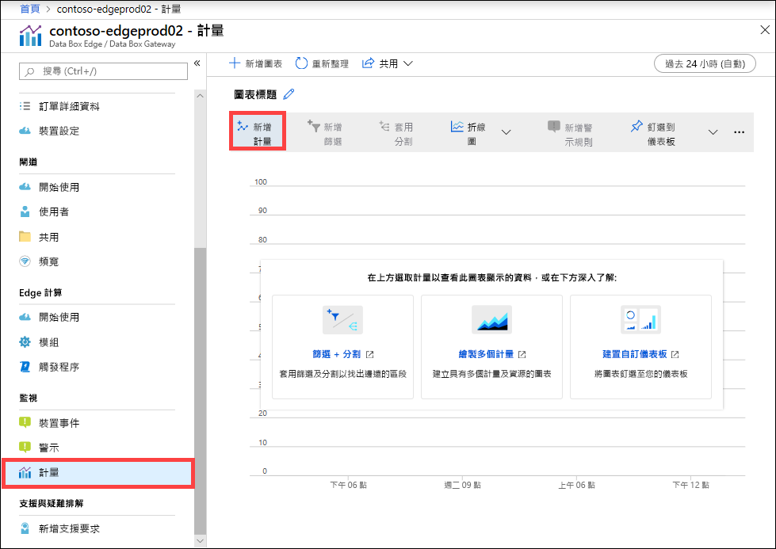
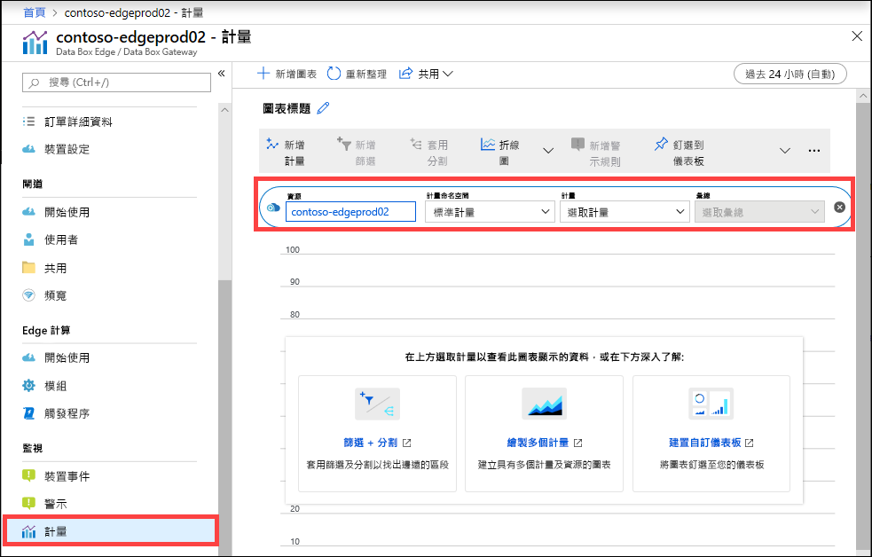
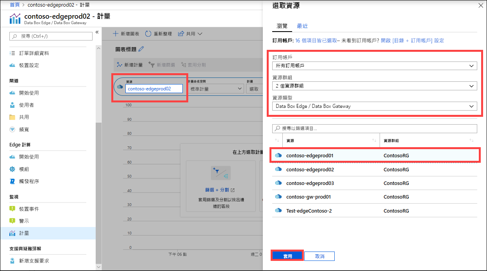
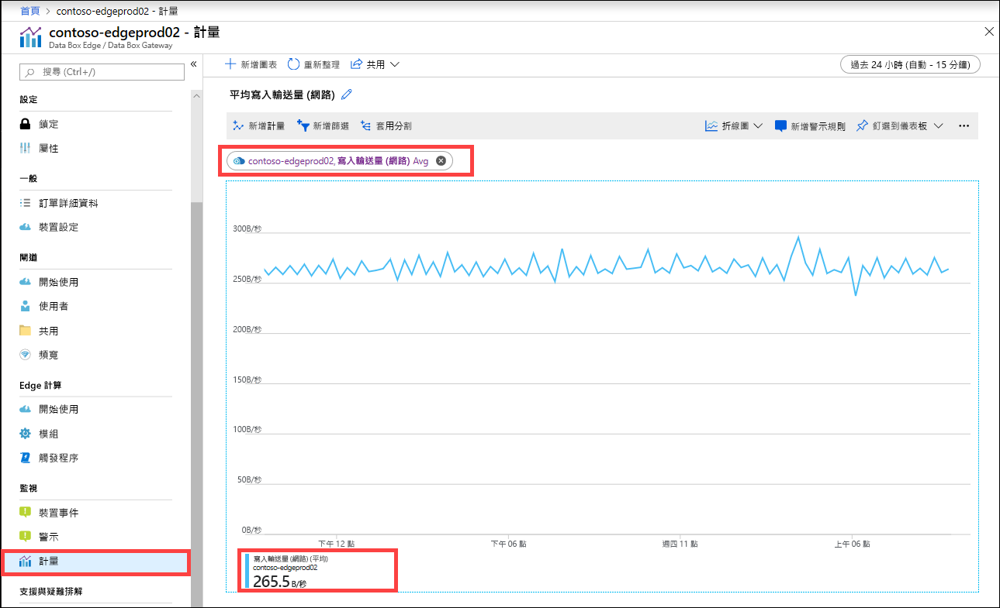
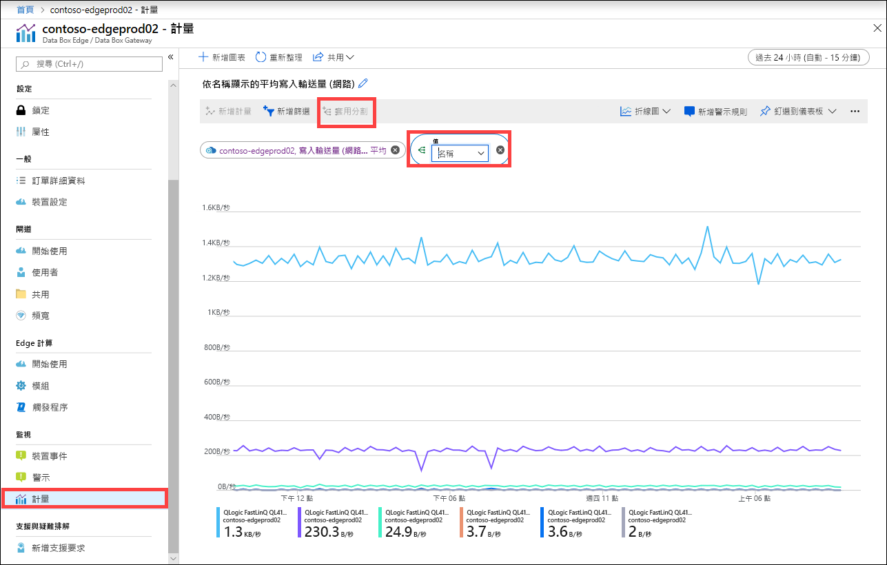

您也可以監視裝置的效能來檢視計量，並在某些情況下針對裝置問題進行疑難排解。

請在 Azure 入口網站中採取下列步驟，以建立所選裝置計量的圖表。

1. 對於您在 Azure 入口網站中的資源，請移至 [監視] > [計量]，然後選取 [新增計量]。

    

2. 資源會自動填入。  

    

    若要指定另一個資源，請選取資源。 在 [選取資源] 刀鋒視窗中，選取訂用帳戶、資源群組、資源類型，以及您要顯示的度量的特定資源，然後選取 [套用]。

    

3. 從下拉式清單中選取計量，以監視您的裝置。 如需這些計量的完整清單，請參閱[裝置上的計量](#metrics-on-your-device)。

4. 從下拉式清單中選取計量時，也可以定義彙總。 彙總是指在指定的時間範圍彙總的實際值。 彙總值可以是平均、最小值或最大值。 從平均、最大值或最小值選取彙總。

    

5. 如果您選取的計量有多個執行個體，則可使用分割選項。 選取 [套用分割]，然後選取您要查看明細的值。

    

6. 如果您目前想查看少數幾個執行個體的明細，您可以篩選資料。 例如，在此案例中，如果您想要僅看到裝置上兩個連線網路介面的網路輸送量，您可以篩選這些介面。 選取 [新增篩選] 並指定要篩選的網路介面名稱。

    

7. 您也可以將圖表釘選至儀表板，這樣輕鬆就能存取圖表。

    

8. 若要將圖表資料匯出至 Excel 試算表，或取得可共用的圖表連結，請從命令列選取 [共用] 選項。

    
