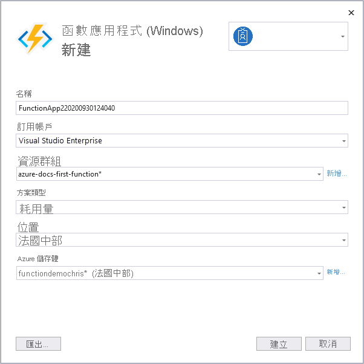
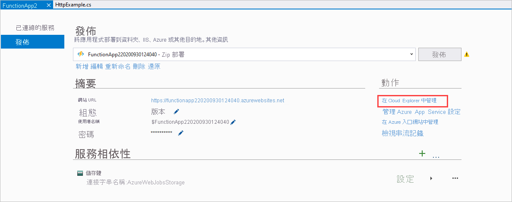

1. 在 [方案總管]  中，以滑鼠右鍵按一下專案並選取 [發佈]  。

2. 在 [選擇發佈目標]  中，使用下表中指定的發佈選項： 

    | 選項      | 描述                                |
    | ------------ |  -------------------------------------------------- |
    | **Azure 函式應用程式** | 在 Azure 雲端環境中建立函式應用程式。 | 
    | **建立新項目** | 在 Azure 中會建立具有相關資源的新函式應用程式。  如果您選擇 [選取現有的]  ，Azure 中現有函式應用程式的所有檔案都會以本機專案中的檔案加以覆寫。 請只在將更新重新發佈至現有函式應用程式時，才使用此選項。 |
    | **從套件檔案執行** | 您的函式應用程式會使用已啟用[從套件執行](../articles/azure-functions/run-functions-from-deployment-package.md)模式的 [Zip 部署](../articles/azure-functions/functions-deployment-technologies.md#zip-deploy)來部署。 此部署是執行函式的建議方法，其可產生更好的效能。  若不使用此選項，請務必在發佈到 Azure 前，先停止在本機執行函式應用程式專案。 |

    

3. 選取 [發佈]  。 如果您尚未從 Visual Studio 登入您的 Azure 帳戶，請選取 [登入]  。 您也可以建立免費 Azure 帳戶。

4. 在 [Azure App Service：  新建] 中，使用下表中指定的值：

    | 設定      | 值  | 描述                                |
    | ------------ |  ------- | -------------------------------------------------- |
    | **名稱** | 全域唯一的名稱 | 用以唯一識別新函式應用程式的名稱。 接受此名稱或輸入新的名稱。 有效字元：`a-z`、`0-9` 和 `-`。 |
    | **訂用帳戶** | 您的訂用帳戶 | 要使用的 Azure 訂用帳戶。 接受此訂用帳戶，或從下拉式清單中選取一個新的訂用帳戶。 |
    | **[資源群組](../articles/azure-resource-manager/management/overview.md)** | 資源群組的名稱 |  要在其中建立函式應用程式的資源群組。 從下拉式清單中選取現有的資源群組，或選擇 [新增]  來建立新的資源群組。|
    | **[主控方案](../articles/azure-functions/functions-scale.md)** | 主控方案的名稱 | 選取 [新增]  以設定無伺服器方案。 請務必選擇 [大小]  之下的 [取用]  。 當您將專案發佈至在[取用方案](../articles/azure-functions/functions-scale.md#consumption-plan)中執行的函式應用程式時，您只需支付您的函式應用程式執行費用。 其他主控方案會產生較高的成本。 如果您在**取用**以外的方案中執行，您必須管理[函式應用程式的調整](../articles/azure-functions/functions-scale.md)。 在[區域](https://azure.microsoft.com/regions/)中選擇 **位置**，此位置應靠近您或靠近函式會存取的其他服務。  |
    | **[Azure 儲存體](../articles/storage/common/storage-account-create.md)** | 一般用途的儲存體帳戶 | Functions 執行階段需要 Azure 儲存體帳戶。 選取 [新增]  以設定一般用途的儲存體帳戶。 您也可以選擇符合[儲存體帳戶需求](../articles/azure-functions/functions-scale.md#storage-account-requirements)的現有帳戶。  |

    

5. 選取 [建立]  以在 Azure 中使用這些設定建立函式應用程式和相關資源，並且部署函式專案程式碼。 

6. 選取 [發佈]，並在部署完成之後記下 [網站 URL]  值，這是您的函式應用程式在 Azure 中的位址。

    
