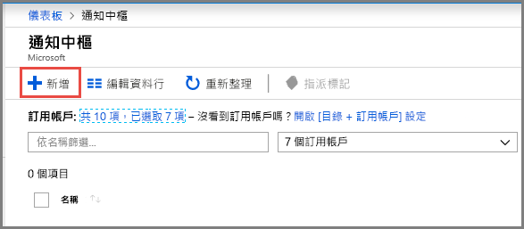
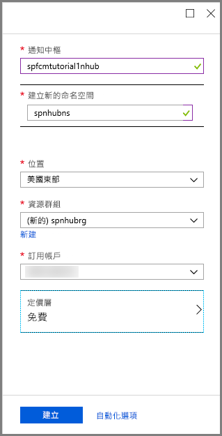
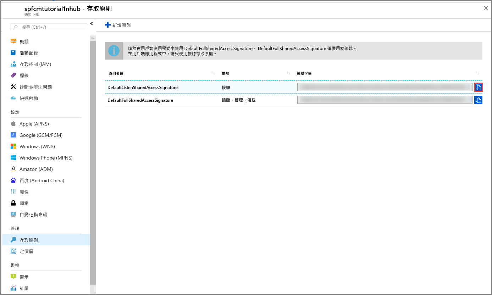

1. 登入 [Azure 入口網站](https://portal.azure.com)。

1. 選取左功能表上的 [所有服務]，然後選取 [行動] 區段中的 [通知中樞]。 選取服務名稱旁邊的星號圖示，將服務加到左功能表上的 [我的最愛]  區段。 將 [通知中樞]  新增至 [我的最愛]  之後，在左功能表上予以選取。

      

1. 在 [通知中樞]  頁面上，選取工具列上的 [新增]  。

      

1. 在 [通知中樞]  頁面上，執行下列步驟：

    1. 在 [通知中樞]  中輸入名稱。  

    1. 在 [建立新的命名空間]  中輸入名稱。 命名空間包含一或多個中樞。

    1. 從 [位置]  下拉式清單方塊選取值。 此值會指定您要在其中建立中樞的位置。

    1. 在 [資源群組]  中選取現有的資源群組，或建立一個新群組。

    1. 選取 [建立]  。

        

1. 選取 [通知]  \(鈴鐺圖示)，然後選取 [前往資源]  。 您也可以重新整理 [通知中樞]  頁面中的清單，然後選取您的中樞。

      

1. 從清單中選取 [存取原則]  。 請記下您可使用的兩個連接字串。 您稍後需要用到這些連接字串來處理推播通知。

      >[!IMPORTANT]
      >「請勿」  在應用程式中使用 **DefaultFullSharedAccessSignature** 原則。 這只能在後端使用。
      >

      
