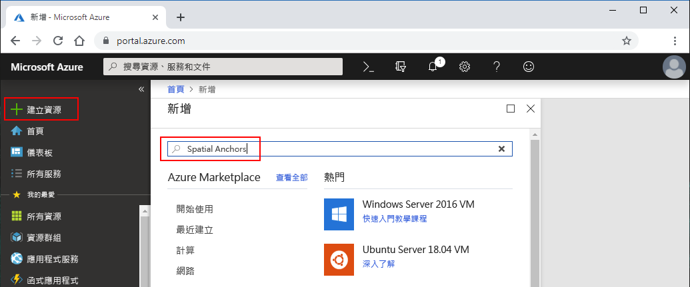
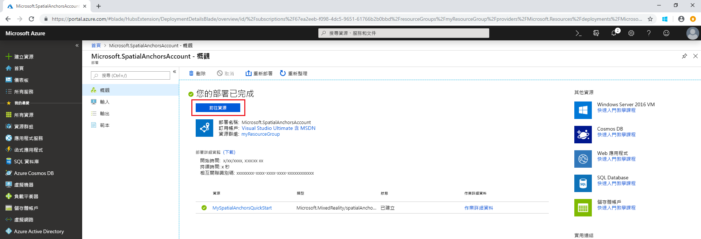
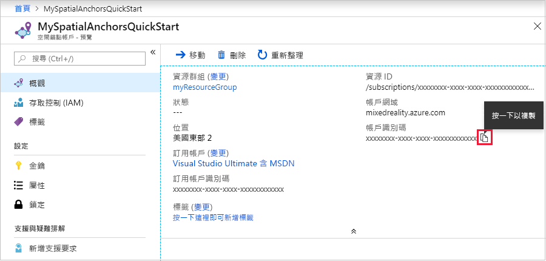

## 建立 Spatial Anchors 資源

移至 <a href="https://portal.azure.com" target="_blank">Azure 入口網站</a>。

在左窗格上，選取 [建立資源]。

使用搜尋方塊搜尋 **Spatial Anchors**。

選取 [空間錨點]，然後選取 [建立]。

在 [空間錨點帳戶] 窗格上，執行下列動作：

* 使用規則英數字元，輸入唯一的資源名稱。  
* 選取您要連結資源的訂用帳戶。  
* 選取 [新建] 來建立資源群組。 將其命名為 **myResourceGroup**，然後選取 [確定]。  

  [!INCLUDE [resource group intro text](resource-group.md)]
  
* 選取要在其中放置資源的位置 (區域)。  
* 選取 [新增] 開始建立資源。

![[空間錨點] 窗格的螢幕擷取畫面，此窗格用於建立資源。](./media/spatial-anchors-get-started-create-resource/create-resource-form.png)

建立資源之後，Azure 入口網站會顯示您的部署已完成。 
   

選取 [移至資源]。 您現在可以檢視資源屬性。 
   
將資源的 [帳戶識別碼] 值複製到文字編輯器，以供稍後使用。

此外，也將資源的 [帳戶網域] 值複製到文字編輯器，以供稍後使用。

在 [設定] 底下，選取 [金鑰]。 將 [主要金鑰] 值、[帳戶金鑰] 複製到文字編輯器，以供稍後使用。

![帳戶 [金鑰] 窗格的螢幕擷取畫面。](./media/spatial-anchors-get-started-create-resource/view-account-key.png)
