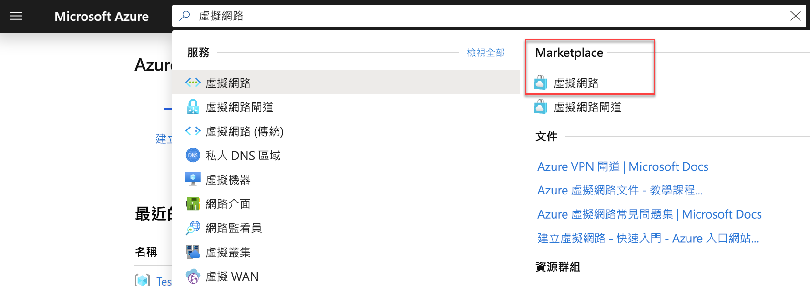
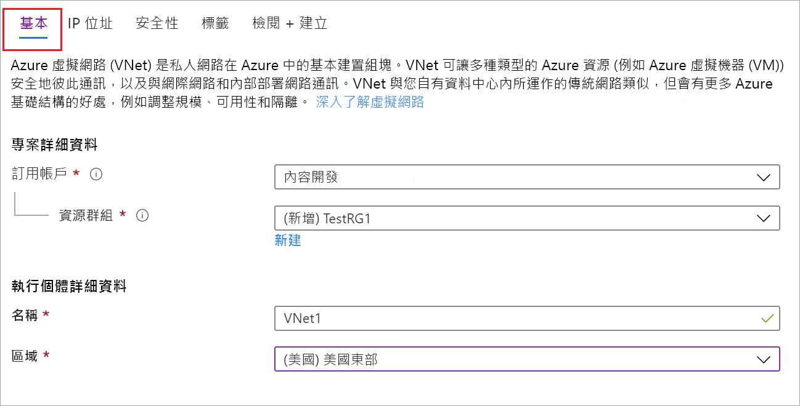
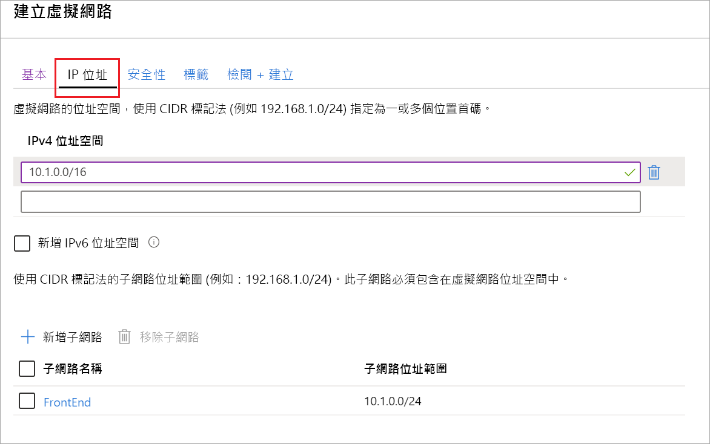

1. 登入 [Azure 入口網站](https://portal.azure.com)。
1. 在 [搜尋資源、服務和文件 (G+/)] 中，輸入 [虛擬網路]。

   
1. 從 **Marketplace** 結果中選取 [虛擬網路]。

   
1. 在 [虛擬網路] 頁面上，選取 [建立]。

   
1. 當您選取 [建立] 之後，[建立虛擬網路] 頁面隨即開啟。
1. 在 [基本] 索引標籤上，設定 [專案詳細資料] 和 VNet 設定的 [執行個體詳細資料]。

   當您填寫欄位時，若欄位中輸入的字元經過驗證，就會變成綠色核取記號。 系統會自動填寫某些值，您可使用自己的值加以取代：

   - **訂用帳戶** ：確認列出的訂用帳戶是否正確。 您可以使用下拉式清單變更訂用帳戶。
   - **資源群組** ：選取現有的資源群組，或按一下 [新建] 來建立新群組。 如需有關資源群組的詳細資訊，請參閱 [Azure Resource Manager 概觀](../articles/azure-resource-manager/management/overview.md#resource-groups)。
   - **Name** ：輸入虛擬網路的名稱。
   - **區域** ：選取您的 VNet 位置。 此位置會決定您部署到此 VNet 的資源存留的位置。

1. 在 [IP 位址] 索引標籤上，設定值。 下列範例中所顯示的值是供示範之用。 根據您所需的設定來調整這些值。

     
   - **IPv4 位址空間** ：依預設，系統會自動建立位址空間。 您可以按一下位址空間來加以調整，以反映自己的值， 也可以新增其他位址空間。
   - **子網路** ：如果您使用預設的位址空間，則系統會自動建立預設子網路。 如果您變更位址空間，則需要新增子網路。 選取 [+ 新增子網路] 以開啟 [新增子網路] 視窗。 設定下列設定，然後選取 [新增] 以新增值：
      - **子網路名稱** ：在此範例中，我們將子網路命名為「FrontEnd」。
      - **子網路位址範圍** ︰此子網路的位址範圍。

1. 在 [安全性] 索引標籤上，目前先保留預設值：

   - **DDoS 保護** ：基本
   - **防火牆** ：已停用
1. 選取 [檢閱 + 建立] 來驗證虛擬網路設定。
1. 在驗證設定之後，請選取 [建立]。
